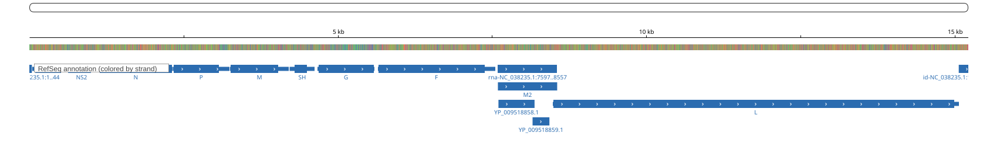
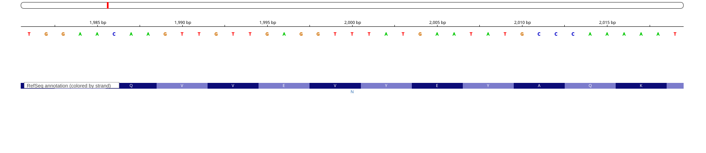

# Week 02 - Obtain genomic data

## Selected genome

I selected the **human respiratory syncytial virus (RSV)** reference genome.

- Organism: Human orthopneumovirus, subgroup A (human respiratory syncytial
  virus, taxid 11250)
- Assembly: [GCF_002815475.1 (ASM281547v1)](https://www.ncbi.nlm.nih.gov/datasets/genome/GCF_002815475.1/)
- Sequence: NC_038235.1, the RefSeq RSV-A reference genome (ICTV species
  exemplar)
- Source: NCBI FTP site,
  <https://ftp.ncbi.nlm.nih.gov/genomes/all/GCF/002/815/475/GCF_002815475.1_ASM281547v1/>

## How to use the Makefile

Requirements: `make`, `curl`, and `gunzip` (all standard on macOS/Linux).

```bash
# Download both the FASTA and the GFF file
make

# Or download them individually
make fasta
make gff

# Remove the downloaded data
make clean
```

The files are organized by data type:

```
week02/
├── Makefile
├── README.md
├── fasta/
│   └── GCF_002815475.1_ASM281547v1_genomic.fna
└── gff/
    └── GCF_002815475.1_ASM281547v1_genomic.gff
```

## Questions

### How large is the genome? How many chromosomes does it have?

```bash
# Genome size (bases, excluding headers and newlines)
grep -v ">" fasta/*.fna | tr -d '\n' | wc -c

# Number of sequences
grep -c ">" fasta/*.fna
```

The genome is **15,222 bp** long and consists of a **single sequence**
(NC_038235.1). RSV does not have chromosomes in the usual sense — it is a
non-segmented, negative-sense, single-stranded RNA virus, so its entire
genome is one RNA molecule (represented as DNA in the assembly). The
assembly therefore contains 1 chromosome-level sequence.

### How many annotations are in the annotation file?

```bash
# Total number of feature lines (excluding comment lines)
grep -vc '^#' gff/*.gff

# Count of each feature type
grep -v '^#' gff/*.gff | cut -f 3 | sort | uniq -c | sort -rn
```

The GFF file contains **44 features** in total:

| Count | Feature type |
|------:|--------------|
| 11 | CDS |
| 10 | mRNA |
| 10 | gene |
| 10 | exon |
| 1 | five_prime_UTR |
| 1 | three_prime_UTR |
| 1 | region |

That is **10 genes** (*NS1, NS2, N, P, M, SH, G, F, M2, L*), the complete
known RSV gene set. There are 11 CDS features because the *M2* gene encodes
two overlapping proteins (M2-1 and M2-2).

### How complete is this genomic build in your opinion?

I consider this build essentially complete. It is the official RefSeq
reference for RSV subgroup A and the ICTV species exemplar, assembled to the
"Complete Genome" level as a single gapless contig with no ambiguous bases
(15,222 of 15,222 bp are A/T/G/C). All 10 known RSV genes are annotated with
their mRNAs and CDS features, including both overlapping reading frames of
the *M2* gene, plus the 5' and 3' UTRs (the leader and trailer regions).

One limitation: this is a single strain of RSV subgroup A, so it does not
represent the diversity of circulating RSV strains (in particular subgroup
B, which has its own reference, NC_001781). But as a reference build for
RSV-A, it is about as complete as a viral genome assembly gets.

---

# Visualize a genome

I loaded the FASTA and the GFF annotation into IGV
([igv.js](https://igv.org), the same engine as the IGV web app). To
reproduce, open <https://igv.org/app/>, load
`fasta/*.fna` via *Genome → Local File* and `gff/*.gff` via
*Tracks → Local File* (or open the included `igv.html` from a local web
server, e.g. `python3 -m http.server`).

### How tightly packed are the genes? Estimate the gene-to-gene distance.

Very tightly packed. In the browser the 10 genes tile the entire 15.2 kb
genome almost end to end, with barely visible gaps between them — the
intergenic distances look like a few tens of bases at most, i.e. roughly
1/1000th of the genome per gap. The exact gaps (from the gene coordinates
shown in the browser) confirm the visual estimate:

| Junction | Gap |
|----------|-----|
| NS1–NS2 | 19 bp |
| NS2–N | 26 bp |
| N–P | 1 bp |
| P–M | 9 bp |
| M–SH | 9 bp |
| SH–G | 44 bp |
| G–F | 52 bp |
| F–M2 | 46 bp |
| M2–L | **overlap of 68 bp** |

So the typical gene-to-gene distance is on the order of 1–50 bp, and the
*M2* and *L* genes actually overlap. Only ~1% of the genome is intergenic.



### Pick a coordinate and inspect the sequence regions around it

I picked coordinate **NC_038235.1:2,000**, which falls inside the *N*
(nucleoprotein) gene. Zooming in to base-pair resolution shows the sequence
around it (positions 1,991–2,012):

```
5'-TGTTGAGGTTTATGAATATGCC-3'   (forward strand; position 2,000 is the 10th base, T)
3'-ACAACTCCAAATACTTATACGG-5'   (reverse strand)
```



### The six reading frames at this coordinate

Any coordinate can be part of a codon in three forward frames (read left to
right on the + strand) and three reverse frames (read right to left on the
complementary strand). Around position 2,000:

Forward strand (5'→3'):

- **Frame +1** (codon starts at 1,991): `TGT TGA GGT TTA TGA ATA TGC` — contains stop codons (TGA), so this frame is closed here.
- **Frame +2** (codon starts at 1,992): `GTT GAG GTT TAT GAA TAT GCC` = V-E-V-Y-E-Y-A — an open frame; this is the actual coding frame of the *N* protein.
- **Frame +3** (codon starts at 1,993): `TTG AGG TTT ATG AAT ATG CCC` = L-R-F-M-N-M-P — open in this window.

Reverse strand (reading the complement 3'→5', i.e. right to left):

- **Frame −1**: `GGC ATA TTC ATA AAC CTC AAC` = G-I-F-I-N-L-N — open in this window.
- **Frame −2**: `GCA TAT TCA TAA ACC TCA ACA` — contains a stop codon (TAA).
- **Frame −3**: `CAT ATT CAT AAA CCT CAA CA.` = H-I-H-K-P-Q — open in this window.

So position 2,000 could be the 1st, 2nd, or 3rd base of a codon on either
strand; of the six frames, only frame +2 is the real one used by the *N*
gene, and IGV's three-frame translation view shows stop codons interrupting
several of the other frames.

### What type of feature is displayed as a data track?

The data track is the **GFF3 annotation track**. The features displayed are
**genes** with their **mRNA/CDS structure** (IGV draws the CDS as thick
boxes with strand arrows; the track also contains exons and UTRs). In this
genome every gene is single-exon, so each feature appears as one solid box.

### Color features by their strand orientation

I colored the annotation track by strand (blue = forward/+, red =
reverse/−). All 10 RSV genes are annotated on the **forward (+) strand**,
so every feature is blue — the annotation is given relative to the plus
strand of the deposited sequence, even though the virion itself packages
the negative-sense RNA.


