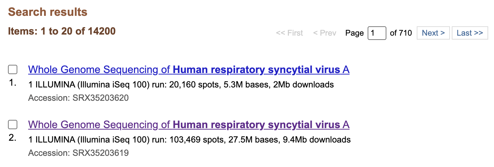
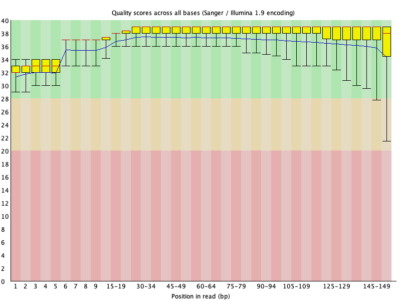
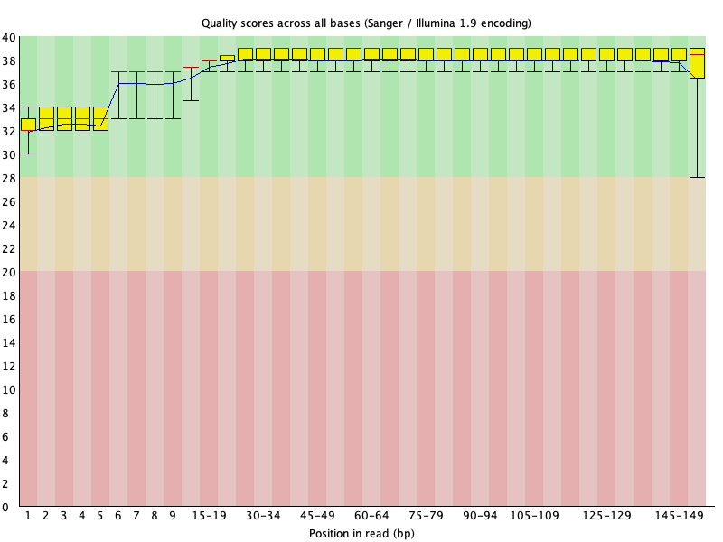
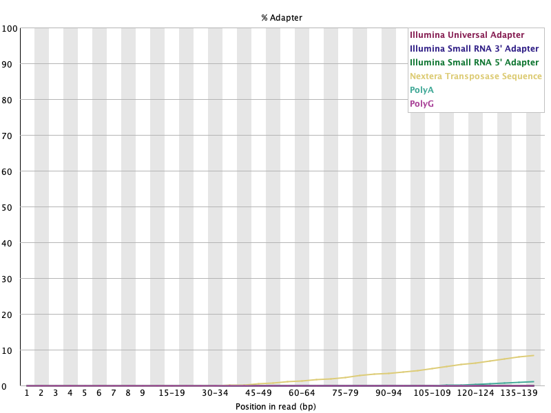
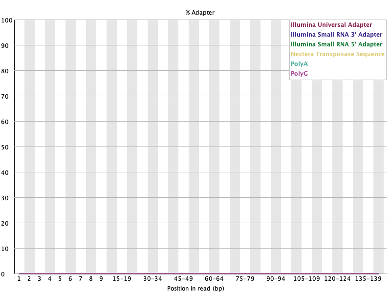
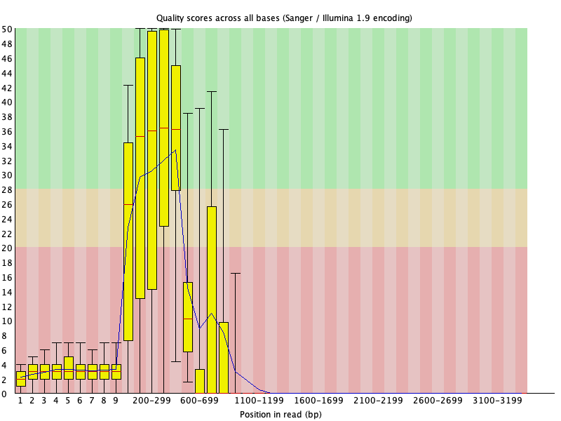
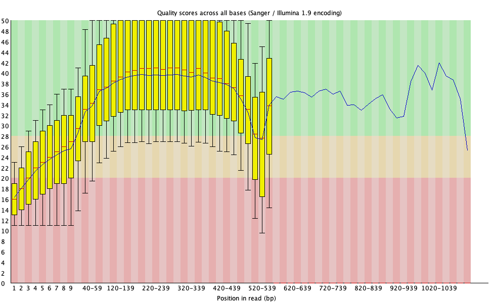
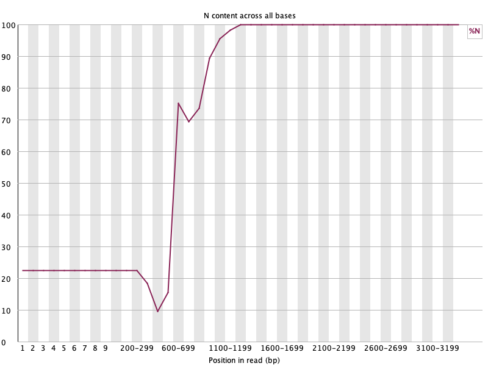
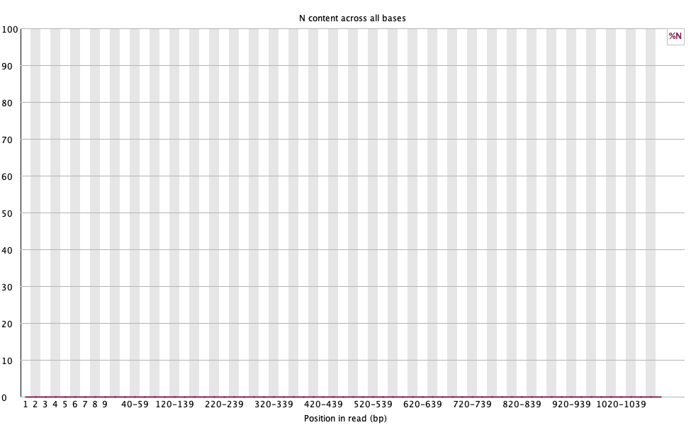

# Week 04 - Get FASTQ from SRA

## Genome

In [week02](../week02/) I selected the **human respiratory syncytial virus
(RSV)** reference genome, RefSeq NC_038235.1 (assembly GCF_002815475.1,
RSV subgroup A, 15,222 bp). This week I looked for the raw sequencing data
behind RSV genomes in the Sequence Read Archive (SRA), downloaded part of two
runs, and ran quality control on them.

SRA search used:
<https://www.ncbi.nlm.nih.gov/sra/?term=human+respiratory+syncytial+virus+(RSV)>

## How to reproduce

Requirements (all in the `bioinfo` environment, except `fastq-dump` which
comes with sra-tools): `make`, `curl`, `csvtk`, `fastq-dump`, `fastqc`,
`fastp`, `seqkit`.

```bash
micromamba activate bioinfo

# Summarize all SRA runs matching the search (Part 1)
make survey

# Download the first N reads of a run and run QC (Part 2)
make                          # default: ACC=SRR35979456 (Illumina), N=10000
make ACC=SRR39304124          # Oxford Nanopore run, nothing else changes
make ACC=SRR39304124 N=5000   # change the number of reads

# Helpers
make info                     # what the SRA metadata says about ACC
make stats                    # read statistics before/after trimming
make clean                    # remove the reads and reports of ACC
make realclean                # remove everything that was generated
```

What `make` does for an accession:

1. Downloads the run metadata (runinfo table) from NCBI and reads the
   **sample name**, **platform**, and **layout** (single/paired) from it.
2. Downloads the first `N` reads with `fastq-dump -X N --split-3` and renames
   the files from the SRR number to `<sample>_<platform>`, e.g.
   `SRR35979456_1.fastq` → `2024RSV_10_illumina_1.fastq`.
3. Runs **FastQC** on the raw reads.
4. Trims the reads with **fastp**. The settings depend on the platform
   (see [QC method](#qc-method)).
5. Runs **FastQC** on the trimmed reads.

Because the layout and platform come from the metadata, the same Makefile
works for paired-end Illumina, single-end Nanopore, Ion Torrent, and so on.
You only change `ACC`.

Files are placed in directories named after the data type:

```
week04/
├── Makefile
├── README.md
├── images/          # SRA screenshot and FastQC plots used in this README
├── metadata/        # SRA runinfo tables (.csv)
├── fastq/           # raw and trimmed reads (.fastq)
├── fastqc/          # FastQC reports (.html, .zip)
└── fastp/           # fastp trimming reports (.html, .json)
```

---

# Part 1: How much RSV data is in the SRA?

I collected the metadata of every run that matches the search with
`make survey`. It uses the E-utilities `esearch` to get the hits and `efetch`
(runinfo format) to download the metadata in batches, then summarizes the
table with `csvtk`. The numbers below are from **2026-09-20**. The database
grows every week, so a later rerun will give slightly larger numbers.

The SRA website shows the same number of hits (14,200 items):



## 1. How "popular" is this genome? How many datasets are available?

RSV is a very well-sequenced virus:

| | Count |
|---|---:|
| Sequencing runs (SRR/ERR/DRR) | **14,200** |
| BioProjects (studies) | 92 |
| BioSamples | 13,008 |
| Total sequence | ~12,200 Gbp (~4.2 TB of SRA files) |
| Median run size | 75 Mbp |

That is a lot for a 15 kb genome. Most runs are clinical samples from
**genomic surveillance**, where public health labs sequence one patient
sample per run to track which RSV lineages are circulating. A few groups
account for a large share of the data:

| BioProject | Submitter | Runs | Data type |
|---|---|---:|---|
| PRJNA1048457 | Minnesota Department of Health | 4,737 | Nanopore GridION amplicon (RSV-A and RSV-B) |
| PRJNA1195144 | Baylor College of Medicine | 1,251 | Illumina NovaSeq metagenomic |
| PRJNA262901 + PRJNA267583 | JCVI | 1,624 | Illumina + Ion Torrent |
| PRJNA1308028 | CDC | 749 | Illumina |
| PRJEB2916 | Wellcome Sanger Institute | 420 | Illumina |

## 2. Breakdown by sequencing strategy and platform

**By library strategy**

| Strategy | Runs | % |
|---|---:|---:|
| AMPLICON | 7,307 | 51.5 |
| WGS | 5,877 | 41.4 |
| RNA-Seq | 611 | 4.3 |
| Targeted-Capture | 311 | 2.2 |
| WGA | 86 | 0.6 |
| OTHER | 8 | 0.1 |

**By platform**

| Platform | Runs | % of runs | % of bases |
|---|---:|---:|---:|
| Illumina | 8,129 | 57.2 | 95.9 |
| Oxford Nanopore | 5,351 | 37.7 | 3.2 |
| Ion Torrent | 424 | 3.0 | 0.1 |
| Capillary (Sanger) | 128 | 0.9 | <0.1 |
| ABI SOLiD | 96 | 0.7 | <0.1 |
| Complete Genomics | 48 | 0.3 | <0.1 |
| DNBSEQ (MGI/BGI) | 24 | 0.2 | 0.8 |

**Most common instruments:** GridION (4,913), Illumina MiSeq (3,249),
NextSeq 2000 (1,918), NovaSeq 6000 (1,864), MinION (438), Ion Torrent PGM
(419), NextSeq 550 (250), iSeq 100 (208), NovaSeq X (197), HiSeq 2500 (146).

**Most common strategy + platform combinations:** WGS on Illumina (5,218),
amplicon on Nanopore (5,159), amplicon on Illumina (2,000), RNA-Seq on
Illumina (506), WGS on Ion Torrent (419).

**By subgroup (organism field):** RSV-A 3,212 runs, RSV-B 3,178 runs. The
other ~7,800 runs are only labeled "human respiratory syncytial virus" or
"Respiratory syncytial virus", with no subgroup.

**By release year:**

| Year | Runs | | Year | Runs |
|---|---:|---|---|---:|
| 2012 | 2 | | 2020 | 164 |
| 2013 | 376 | | 2021 | 36 |
| 2014 | 83 | | 2022 | 325 |
| 2016 | 8 | | 2023 | 397 |
| 2017 | 37 | | 2024 | 1,736 |
| 2018 | 1,808 | | 2025 | 4,691 |
| 2019 | 36 | | 2026 (to Sep 20) | 4,501 |

## 3. What is interesting or surprising?

- **Most of the data is very recent.** 77% of all runs (10,928) were released
  in 2024–2026. This timing matches the first RSV vaccines and the infant
  antibody nirsevimab, both approved in 2023, and the sequencing capacity
  public health labs built during COVID-19. Surveillance now watches whether
  RSV changes under this new immune pressure (for example, mutations in the F
  protein that could escape nirsevimab). Before that, data came in one-time
  bursts from single large projects, such as JCVI in 2018 (1,624 runs) and
  the Sanger Institute in 2013.
- **One state health department submitted a third of all runs.** The
  Minnesota Department of Health deposited 4,737 runs, all Nanopore GridION
  amplicon data. Nanopore is only 3% of the bases but 38% of the runs,
  because cheap small runs (one sample per barcode) suit routine
  surveillance.
- **The data volume is very skewed.** The median run has 75 Mbp (about
  5,000× coverage of a 15 kb genome, already plenty), but the top 1% of runs
  hold 43% of all bases. Eighteen runs from one inter-laboratory metagenomic
  study (PRJNA1026487, sample names like `Lab 1C-RSV-spike 1e6`, RSV spiked
  into samples at different amounts) contain 2.3 Tbp. That is 19% of all RSV
  bases in 0.13% of the runs, and almost all of it must be background
  (human/host) sequence, not RSV.
- **Not every hit is RSV sequence.** The text search also matches studies
  that only *mention* RSV: for example, mouse and human RNA-Seq of the host
  response to infection (organism *Mus musculus* / *Homo sapiens*).
- **The history of sequencing technology is visible.** The oldest run is from
  2012 (MiSeq RNA-Seq), and there are still runs from discontinued platforms:
  ABI SOLiD, Complete Genomics, Ion Torrent PGM, and Sanger capillary.

---

# Part 2: Download FASTQ files and run QC

## Runs selected

I chose two RSV-A runs from two different platforms to check that the
Makefile is generic. Both are RSV subgroup A, the same subgroup as the
week02 reference.

| | Illumina (default) | Oxford Nanopore |
|---|---|---|
| Accession | [SRR35979456](https://www.ncbi.nlm.nih.gov/sra/SRR35979456) | [SRR39304124](https://www.ncbi.nlm.nih.gov/sra/SRR39304124) |
| Sample | 2024RSV_10 | MN-MDH-RSVA-04791 |
| Submitter | University of New South Wales | Minnesota Department of Health |
| Instrument | Illumina MiSeq | GridION |
| Strategy / layout | WGS, paired-end 2×151 bp | AMPLICON, single-end |
| Total reads in run | 181,607 pairs | 80,159 reads |
| Downloaded (`N`) | first 10,000 pairs | first 10,000 reads |
| File names | `2024RSV_10_illumina_1.fastq`, `_2.fastq` | `MN-MDH-RSVA-04791_oxford_nanopore.fastq` |

```bash
make                    # Illumina run
make ACC=SRR39304124    # Nanopore run
```

## QC method

- **Visualization:** FastQC on the reads before and after trimming. The plots
  below are FastQC's own images, copied from the report archives, e.g.
  `unzip -p fastqc/2024RSV_10_illumina_2_fastqc.zip 2024RSV_10_illumina_2_fastqc/Images/per_base_quality.png > images/illumina_raw_quality.png`.
- **Trimming:** fastp, with settings chosen from the platform in the metadata:
  - **Short reads (Illumina, etc.):** adapter detection and removal for
    paired-end reads, sliding-window quality trimming (4 bp window, cut when
    the mean quality drops below Q20, like Trimmomatic
    `SLIDINGWINDOW:4:20`), and removal of reads shorter than 50 bp.
  - **Long reads (Nanopore/PacBio):** trim low-quality bases (<Q10) only from
    the two ends, drop reads with an average quality below Q12, and drop
    reads shorter than 200 bp. I first tried the Illumina settings on the
    Nanopore reads, and they removed **every** read: Nanopore reads almost
    always contain a low-quality stretch somewhere, and a sliding window cuts
    the read at the first one.

## Results: Illumina (SRR35979456)

`make stats` (seqkit) before and after trimming:

| File | Reads | Bases | Avg length | Q30 | Avg quality |
|---|---:|---:|---:|---:|---:|
| read 1, raw | 10,000 | 1,510,000 | 151.0 | 98.12% | 32.6 |
| read 1, trimmed | 9,260 | 1,356,151 | 146.5 | 99.37% | 36.0 |
| read 2, raw | 10,000 | 1,510,000 | 151.0 | 93.89% | 28.0 |
| read 2, trimmed | 9,260 | 1,335,738 | 144.2 | 97.97% | 32.7 |

fastp found the **Nextera transposase adapter** (`CTGTCTCTTATACACATCT`),
trimmed it from 2,010 reads, and removed 740 pairs (7.4%) that became
shorter than 50 bp.

FastQC before → after:

| Module | Raw | Trimmed |
|---|---|---|
| Per base sequence quality | PASS | PASS |
| Adapter content | WARN | **PASS** |
| Sequence length distribution | PASS | WARN (expected, reads now have different lengths) |
| Per base sequence content | FAIL | FAIL |
| Sequence duplication levels | FAIL / WARN | FAIL |

**Per base sequence quality, read 2.** The lowest whisker at the 3' end
rises from ~Q21 to ~Q28 after trimming.

| Raw | Trimmed |
|---|---|
|  |  |

**Adapter content, read 1.** Before trimming, the Nextera sequence rises to
~8% of reads toward the 3' end. After trimming it is gone.

| Raw | Trimmed |
|---|---|
|  |  |

**Did QC make a difference?** Only a small one. This MiSeq run was already
good (98% of read-1 bases ≥ Q30). Trimming removed the Nextera adapter
read-through (Adapter Content WARN → PASS) and cut the low-quality 3' ends of
read 2. You can see this in the quality plot: the lower whiskers at the end of
the read move up, and the mean quality at positions 130–134 rises from 36.3 to
37.9. The two remaining FAILs are not fixed by trimming and are not really
problems. *Per base sequence content* fails because of the known sequence
bias of Nextera tagmentation in the first ~10 bases. *Duplication* fails
because 10,000 read pairs from a 15 kb genome is ~200× coverage, so many reads
start at the same positions.

## Results: Oxford Nanopore (SRR39304124)

| File | Reads | Bases | Avg length | Q20 | Avg quality | N bases |
|---|---:|---:|---:|---:|---:|---:|
| raw | 10,000 | 5,142,443 | 514.2 | 69.91% | 6.4 | 1,074,976 |
| trimmed | 7,655 | 3,859,372 | 504.2 | 92.83% | 21.1 | 0 |

FastQC before → after:

| Module | Raw | Trimmed |
|---|---|---|
| Per base N content | FAIL | **PASS** |
| Per sequence quality scores | FAIL | **PASS** |
| Per base sequence quality | FAIL | FAIL |
| Overrepresented sequences | FAIL | FAIL |
| Per sequence GC content | FAIL | FAIL |

**Per base sequence quality.** In the raw reads the mean quality of the
first bases is only ~Q3, and it collapses after ~600 bp. After trimming, the
mean starts at ~Q16 and stays around Q38–40 for most of the ~500 bp amplicons. (The
x-axis ends at ~3.3 kb in the raw plot and ~1.1 kb after trimming, because
the longest reads were removed.)

| Raw | Trimmed |
|---|---|
|  |  |

**Per base N content.** Before trimming, ~23% of the bases at every position
are `N`. The value climbs to 100% for positions past ~1 kb, because almost
all reads longer than 1 kb (75 of 78) are the masked all-`N` reads. After
trimming, there are no `N`s left.

| Raw | Trimmed |
|---|---|
|  |  |

**Did QC make a difference?** Yes, a large one, but the most interesting part
was *why*:

- **22.7% of the raw reads (2,269 of 10,000) consist entirely of `N`s with
  quality 0.** These are not sequencing errors. They are most likely reads
  that the submitter or NCBI masked with a *human read scrubber*, which
  replaces reads that look human with `N`s before clinical data is made
  public. They are the top "overrepresented sequence" in the raw report and
  pull the mean quality at position 1 down to Q2. Trimming removed all of
  them, so Per base N content and Per sequence quality scores went from FAIL
  to PASS, and the average read quality rose from 6.4 to 21.1.
- **Per base sequence quality still FAILs.** FastQC's thresholds are designed
  for Illumina data, and even good Nanopore reads rarely stay above them.
- **Overrepresented sequences still FAILs, now for a different reason.** With
  the N reads gone, the top hits (~27% of reads) are the Oxford Nanopore
  sequencing adapter and native barcode (`...TTCGTTCAGTTACGTATTGCTAAGGTTAA...`)
  at the start of the reads. This is not RSV sequence. fastp does not
  recognize it, so a proper Nanopore workflow would also remove
  adapters/barcodes and primers (e.g. with Porechop or `dorado trim`)
  before assembly or variant calling.

## Summary

The same QC step had very different effects on the two platforms. For the
high-quality Illumina run it was a small improvement (adapter removal and
cleaner 3' ends). For the Nanopore run it was essential: it removed a fifth
of the reads that were masked placeholders. FastQC also showed that a
Nanopore-specific step (adapter/barcode trimming) is still missing.
